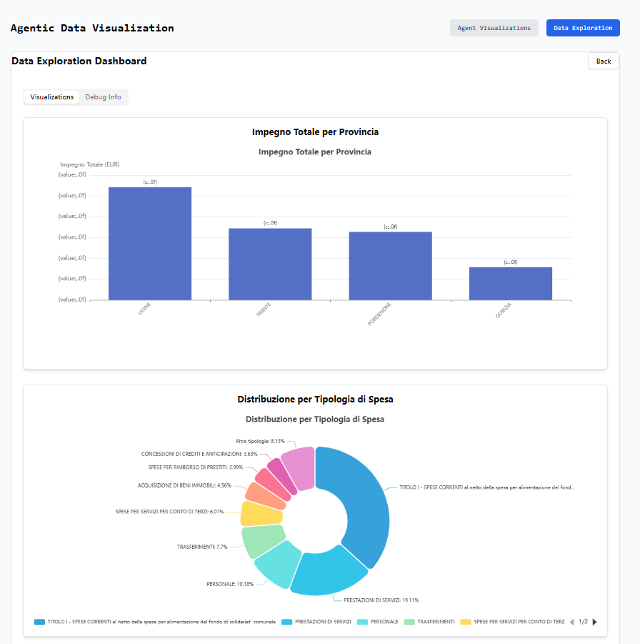

# Agentic Dashboard App

<div align="center">
  
  <br>
  <a href="https://github.com/learnbydoingwithsteven/agentic-dashboard-app/stargazers"></a>
  <a href="https://github.com/learnbydoingwithsteven/agentic-dashboard-app/network/members"></a>
  <a href="https://github.com/learnbydoingwithsteven/agentic-dashboard-app/pulls"></a>
  <a href="https://github.com/learnbydoingwithsteven/agentic-dashboard-app/issues"></a>
  <a href="https://github.com/learnbydoingwithsteven/agentic-dashboard-app/blob/main/LICENSE"></a>
</div>

> An AI-powered data visualization platform that uses LLM agents to automatically generate insightful visualizations from your datasets, with support for both cloud-based and local LLMs.

## 🌟 Overview

The Agentic Dashboard App is a cutting-edge platform that combines the power of Large Language Models (LLMs) with data visualization to help users gain insights from their data without extensive coding or data science expertise. The application uses a team of specialized AI agents to analyze datasets, identify patterns, and generate meaningful visualizations. With a focus on flexibility and user experience, it supports both cloud-based LLMs through Groq's API and local models via Ollama, making it accessible for users with varying computational resources and privacy requirements.

<div align="center">
  
</div>

### Key Differentiators

- **AI-First Approach**: Uses a team of specialized LLM agents (analyst, coder, manager) to collaboratively generate visualizations
- **Flexible LLM Integration**: Seamlessly switch between cloud-based LLMs (Groq) and local models (Ollama)
- **Real-time Agent Monitoring**: Watch the agents' thought process as they analyze your data with detailed conversation logs
- **Code Execution**: Secure sandbox for executing Python visualization code with support for Plotly and ECharts
- **Interactive UI**: Modern, responsive interface with real-time updates and horizontally scrollable data tables
- **Multi-visualization Dashboard**: Generate multiple visualizations from a single dataset with different agent prompts
- **Job Control**: Ability to cancel running agent jobs and reset the backend state
- **Automatic Data Exploration**: Quick insights through automated ECharts visualizations of dataset characteristics

## 🛠️ Tech Stack

### Frontend
- **React 18** with **TypeScript** for type-safe component development
- **Vite** for lightning-fast development and optimized builds
- **TailwindCSS** with **shadcn/ui** for beautiful, responsive UI components
- **ECharts** for interactive, customizable data visualizations
- **Plotly.js** for advanced, publication-quality visualizations
- **Radix UI** for accessible, composable UI primitives

### Backend
- **Flask** with **CORS** support for a lightweight, flexible API server
- **Autogen** framework for creating and orchestrating LLM agents
- **Groq Client** for accessing cloud-based LLMs (Llama 3, Mixtral, etc.)
- **Ollama Integration** for running models locally (Llama 3, Mistral, Gemma, etc.)
- **Pandas** for powerful data manipulation and analysis
- **Python-dotenv** for environment variable management

## 📂 Project Structure

```
agentic-dashboard-app/
├── assets/                 # Project screenshots and images
│
├── backend/                # Python backend (Flask)
│   ├── src/                # Source code
│   │   ├── agent_service.py         # Autogen agent orchestration
│   │   ├── api_key_middleware.py    # API key validation
│   │   ├── code_execution_service.py # Secure Python code execution
│   │   ├── data_exploration_service.py # ECharts visualization generation
│   │   ├── main.py                  # Flask API endpoints
│   │   ├── ollama_config.py         # Ollama integration
│   │   └── uploads/                 # Uploaded datasets storage
│   ├── .env                 # Environment variables (create this file)
│   ├── requirements.txt     # Backend dependencies
│   └── set_env.ps1          # PowerShell script for setting environment variables
│
├── frontend/               # React frontend (TypeScript)
│   ├── public/             # Static assets
│   ├── src/                # Application code
│   │   ├── app/            # Main application components
│   │   │   └── page.tsx    # Main application page
│   │   ├── components/     # Reusable UI components
│   │   │   ├── ui/         # Base UI components (shadcn/ui)
│   │   │   ├── DataExploration/ # Data exploration components
│   │   │   │   ├── ChartErrorBoundary.tsx # Error handling for charts
│   │   │   │   ├── DataExplorationPage.tsx # Data exploration page
│   │   │   │   ├── EChartsVisualization.tsx # ECharts visualization component
│   │   │   │   └── index.ts # Component exports
│   │   │   ├── AgentConversationMonitor.tsx # Real-time agent logs
│   │   │   ├── ApiKeySettings.tsx # API key management
│   │   │   ├── CodeVisualization.tsx # Code execution results
│   │   │   └── ErrorBoundary.tsx # Global error boundary
│   │   ├── hooks/          # Custom React hooks
│   │   │   ├── useApiKey.ts # API key management hook
│   │   │   └── use-toast.ts # Toast notification hook
│   │   ├── lib/            # Utility functions
│   │   ├── utils/          # Helper utilities
│   │   └── main.tsx        # Application entry point
│   ├── package.json        # Frontend dependencies
│   └── vite.config.ts      # Vite configuration
│
├── 2015---Friuli-Venezia-Giulia---Gestione-finanziaria-Spese-Enti-Locali.csv # Sample dataset
└── README.md               # Project documentation
```

## ✨ Features

### 🤖 AI Agent System

The application uses a team of specialized AI agents to analyze data and generate visualizations:

- **Data Analyst Agent**: Examines the dataset and identifies meaningful patterns and insights
- **Visualization Coder Agent**: Translates insights into Python code using Plotly or ECharts
- **Manager Agent**: Coordinates the workflow between agents and ensures quality output

Each agent can be configured to use different LLM models, allowing you to optimize for different tasks (e.g., using a more powerful model for coding and a faster model for analysis).

<div align="center">
  
</div>

<div align="center">
  
</div>

### 📊 Visualization Capabilities

- **Automatic Visualization Generation**: Get instant insights without writing code
- **Natural Language Prompts**: Request specific visualizations using plain English
- **Custom Code Execution**: Write and execute your own Python visualization code
- **Interactive Plots**: Explore data with interactive Plotly and ECharts visualizations
- **Data Exploration**: Automatic generation of summary statistics and basic visualizations
- **Horizontally Scrollable Tables**: View large datasets comfortably with responsive tables

<div align="center">
  
</div>

<div align="center">
  
</div>

### 🔄 Workflow

1. **Configure API Settings**: Choose between Groq API or local Ollama models
2. **Upload Dataset**: CSV files with tabular data (or use the included sample dataset)
3. **Generate Visualizations**: Automatically or with custom prompts
4. **Monitor Progress**: Watch the agents' thought process in real-time
5. **Explore Results**: Interact with the generated visualizations
6. **Data Exploration**: Switch to the Data Exploration view for quick insights

### 🛡️ Security & Performance

- **Secure Code Execution**: Sandboxed environment for running Python code
- **Efficient Data Processing**: Optimized for handling large datasets with automatic type detection
- **Job Control**: Cancel long-running jobs and reset the system state
- **Model Flexibility**: Seamlessly switch between cloud and local models as needed
- **API Key Management**: Securely store and manage your API keys in the browser
- **Error Handling**: Robust error boundaries to prevent visualization failures

## 🚀 Installation & Setup

### Prerequisites

- **Python 3.10+** - For the backend server
- **Node.js 18+** - For the frontend application
- **pnpm** - Package manager for the frontend
- **One of the following**:
  - **Groq API Key** - Get one from [Groq Console](https://console.groq.com/)
  - **Ollama** - Install from [ollama.com](https://ollama.com/) and pull models like `ollama pull llama3`

### Backend Setup

1. **Clone the repository**:
   ```bash
   git clone https://github.com/learnbydoingwithsteven/agentic-dashboard-app.git
   cd agentic-dashboard-app
   ```

2. **Set up Python environment**:
   ```bash
   cd backend
   python -m venv venv

   # On Windows
   venv\Scripts\activate

   # On macOS/Linux
   source venv/bin/activate
   ```

3. **Install dependencies**:
   ```bash
   pip install -r requirements.txt
   ```

4. **Configure LLM provider**:

   **Option 1: Create a .env file** (recommended)

   Create a file named `.env` in the `backend` directory with the following content:
   ```
   GROQ_API_KEY=your_groq_api_key_here
   # Optional: Set to "true" to use Ollama by default
   USE_OLLAMA=false
   ```

   **Option 2: Set environment variables directly**

   ```bash
   # On Windows (PowerShell)
   $env:GROQ_API_KEY = "your_groq_api_key_here"
   # Optional: Set to "true" to use Ollama by default
   $env:USE_OLLAMA = "false"

   # On macOS/Linux
   export GROQ_API_KEY=your_groq_api_key_here
   # Optional: Set to "true" to use Ollama by default
   export USE_OLLAMA=false
   ```

   **Option 3: Use the provided PowerShell script** (Windows only)
   ```powershell
   # Edit set_env.ps1 first to add your API key
   .\set_env.ps1
   ```

   **Option 4: Ollama Only**
   - Ensure Ollama is installed and running
   - Pull models you want to use: `ollama pull llama3`
   - Set `USE_OLLAMA=true` in your environment or .env file
   - No Groq API key needed when using Ollama exclusively

5. **Start the backend server**:
   ```bash
   # From the backend directory
   python src/main.py
   ```
   The server will run on http://localhost:5001

### Frontend Setup

1. **Navigate to the frontend directory**:
   ```bash
   cd ../frontend
   ```

2. **Install dependencies**:
   ```bash
   pnpm install
   ```

   If you encounter issues with the `picomatch` dependency, try:
   ```bash
   pnpm install picomatch@4.0.2 --save-dev
   pnpm install
   ```

3. **Start the development server**:
   ```bash
   pnpm dev
   ```
   The frontend will be available at http://localhost:5173

## 🧪 Usage Guide

1. **Open the application** in your browser at http://localhost:5173

2. **Configure API Settings**:
   - Choose between Groq API or Ollama using the toggle switch
   - If using Groq, enter your API key in the provided field
   - If using Ollama, ensure the Ollama application is running on your machine
   - Click "Save & Validate" to verify your settings
   - The application will display available models after successful validation

3. **Upload a Dataset**:
   - Click "Choose File" to select a CSV file
   - The app automatically uses the included sample Italian public finance dataset if you don't upload one
   - After uploading, you'll see a confirmation message

4. **Generate Visualizations**:
   - **Automatic Analysis**: Click "Generate Visualizations" for AI-powered analysis without specific prompts
   - **Custom Prompts**: Enter a specific prompt like "Show me a comparison of total commitments by province" and click "Generate"
   - **Model Selection**: Optionally select specific models for each agent using the dropdown menus
   - **Monitor Progress**: Watch the agent conversation in real-time on the right panel
   - **Cancel Jobs**: Use the "Cancel" button to stop long-running visualization jobs

5. **Explore Results**:
   - Interact with the generated Plotly visualizations
   - Hover over data points for detailed information
   - Zoom, pan, and export visualizations using the Plotly toolbar
   - Try different prompts to explore various aspects of your data

6. **Data Exploration View**:
   - Click the "Data Exploration" button at the top of the page to switch to the data exploration view
   - Browse automatically generated ECharts visualizations based on your dataset
   - View summary statistics and dataset information in the tabbed interface
   - Horizontally scroll through data tables for wide datasets
   - Click "Go Back" to return to the agent visualization view

7. **Advanced Features**:
   - **Custom Code**: Use the "Execute Code" feature to run your own Python visualization code
   - **Reset Backend**: Click "Reset Backend" to clear the current state and start fresh
   - **Switch Models**: Toggle between Ollama and Groq at any time using the API settings
   - **Save API Keys**: Your API keys are saved in the browser's local storage for convenience

## 🔧 Troubleshooting

### Common Issues

#### Backend Issues

- **"API key is required" error**:
  - Make sure you've entered a valid Groq API key or selected Ollama as your provider
  - Check that your `.env` file contains the correct API key
  - Verify that environment variables are properly set

- **"No models found" error**:
  - If using Ollama, ensure the Ollama application is running on your machine
  - Try running `ollama list` in your terminal to verify available models
  - If using Groq, verify your API key is valid and has access to models

- **Visualization generation fails**:
  - Check the agent logs for specific error messages
  - Verify that your dataset is properly formatted and contains the expected columns
  - Try with a simpler prompt or the sample dataset

- **"ModuleNotFoundError" when starting backend**:
  - Ensure you've activated your virtual environment
  - Run `pip install -r requirements.txt` again to verify all dependencies are installed

#### Frontend Issues

- **"picomatch" dependency error**:
  - Run `pnpm install picomatch@4.0.2 --save-dev` followed by `pnpm install`
  - If issues persist, try deleting `node_modules` and `pnpm-lock.yaml` then running `pnpm install` again

- **Cannot switch from Ollama back to Groq**:
  - Use the "Reset Backend" button to clear the current state
  - Set `USE_OLLAMA=false` explicitly in your environment or `.env` file
  - Restart the backend server after changing the environment variable

- **Blank visualization or visualization error**:
  - Check the error message in the visualization panel
  - Try a different prompt that specifies exact column names from your dataset
  - Check if your dataset contains the columns mentioned in your prompt

- **UI freezes or becomes unresponsive**:
  - Cancel any running jobs using the "Cancel" button
  - Use the "Reset Backend" button to clear the current state
  - Refresh the page if the UI remains unresponsive

### Debugging Tips

<div align="center">
  
</div>

1. **Check the backend logs**:
   - Look for error messages in the terminal where the backend is running
   - Pay attention to warnings about missing API keys or configuration issues

2. **Inspect network requests**:
   - Use browser developer tools (F12) to check API responses
   - Look for 4xx or 5xx errors in the Network tab
   - Verify that requests to the backend include the correct headers

3. **Reset the application state**:
   - Use the "Reset Backend" button to clear any stale state
   - Clear browser local storage if API settings seem corrupted
   - Restart both frontend and backend servers

4. **Dataset issues**:
   - Ensure your CSV file uses standard delimiters (comma or semicolon)
   - Check for special characters or encoding issues in your dataset
   - Try with the included sample dataset to verify the application works correctly

5. **Model selection**:
   - If a specific model fails, try selecting a different model from the dropdown
   - For complex visualizations, prefer more powerful models like Llama 3 70B
   - For faster results with simpler visualizations, try smaller models

## 🤝 Contributing

Contributions are welcome! Here's how you can help:

1. **Fork the repository**
2. **Create a feature branch**: `git checkout -b feature/amazing-feature`
3. **Commit your changes**: `git commit -m 'Add some amazing feature'`
4. **Push to the branch**: `git push origin feature/amazing-feature`
5. **Open a Pull Request**

### Development Guidelines

- Follow the existing code style and organization
- Add tests for new features
- Update documentation as needed
- Ensure all tests pass before submitting a PR

### Feature Ideas

Here are some ideas for future improvements:

- **Multiple Dataset Support**: Allow users to upload and switch between multiple datasets
- **Dashboard Layouts**: Create customizable dashboard layouts with drag-and-drop functionality
- **Export Functionality**: Add options to export visualizations as images or interactive HTML
- **User Authentication**: Add user accounts to save and share visualizations
- **Additional Visualization Libraries**: Integrate with more visualization libraries like D3.js
- **Advanced Data Processing**: Add support for data cleaning and transformation operations
- **Collaborative Features**: Allow multiple users to work on the same dashboard
- **Mobile Optimization**: Improve the mobile experience for on-the-go data analysis

## 📜 License

This project is licensed under the Apache License, Version 2.0 - see the LICENSE file for details.
Copyright © 2025 Steven Wang. All rights reserved. Licensed under the Apache License, Version 2.0.

## 🙏 Acknowledgments

- [Autogen](https://github.com/microsoft/autogen) for the multi-agent framework
- [Groq](https://groq.com/) for their fast LLM API
- [Ollama](https://ollama.com/) for making local LLMs accessible
- [Plotly](https://plotly.com/) for the interactive visualization library
- [ECharts](https://echarts.apache.org/) for the powerful charting library
- [React](https://reactjs.org/) and [Vite](https://vitejs.dev/) for the frontend framework
- [shadcn/ui](https://ui.shadcn.com/) for the beautiful UI components
- [TailwindCSS](https://tailwindcss.com/) for the utility-first CSS framework

---

<p align="center">
  Built with ❤️ by <a href="https://github.com/learnbydoingwithsteven">Learn By Doing With Steven</a>
</p>
